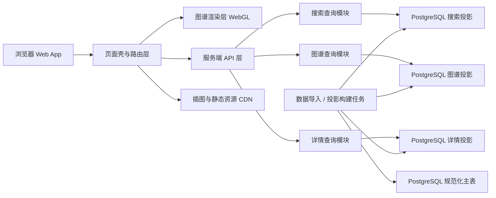

# 中国历史人物关系图谱一期技术方案

## 1. 文档信息

- 文档名称：`中国历史人物关系图谱` 一期技术方案
- 版本：`v0.2`
- 更新时间：`2026-05-28`
- 对应产品文档：[prd.md](/Users/changhuanli/explore/History/prd.md)
- 文档目标：把 PRD 收敛成可开工的技术边界、服务端职责、数据结构、关键契约和渐进落地路径

## 2. 目标、范围、非目标

### 2.1 技术目标

1. 在浏览器中提供可交互的历史人物关系图谱体验，支持朝代切换、搜索定位、节点聚焦、关系展开、详情联动和时间轴联动。
2. 在当前没有正式历史数据的前提下，先把服务端、数据 schema、投影链路和前端消费契约定死，后续只补数据。
3. 为后续逐步补充更多朝代、人物、事件和插图保留扩展能力，但不为未来假设过度设计。

### 2.2 本期设计范围

1. 浏览器可访问的 Web 应用。
2. 首页、朝代图谱页、搜索、人物详情、事件详情、时间轴、插图资源承接。
3. 图谱渲染技术路线、服务端职责、数据库 schema、数据投影、接口契约、缓存策略、发布与回滚策略。
4. 只读浏览链路，不包含录入后台页面。

### 2.3 非目标

1. 不设计移动端和客户端形态。
2. 不设计内容生产后台页面。
3. 不在一期实现全朝代全量联通图。
4. 不引入实时协作、登录、评论、收藏、推荐算法。
5. 不在一期为极大规模数据集设计分布式检索或复杂图计算平台。

## 3. 现状和约束

### 3.1 现状

1. 当前目录只有 [prd.md](/Users/changhuanli/explore/History/prd.md)，没有现成代码、数据结构和部署方案。
2. 产品已明确以图谱探索为核心，数据可后续补充。
3. 当前最关键的问题不是“先做页面还是先做数据”，而是“先把服务端边界和数据结构定好，否则后面补数据会持续返工”。

### 3.2 关键约束

1. 主体验必须发生在浏览器中，不能依赖客户端能力。
2. 图谱必须可交互，不能退化为静态图或普通列表页面。
3. 搜索结果必须进入上下文，而不是落到孤立详情页。
4. 历史数据允许不完整，但页面骨架不能缺失。
5. 一期范围必须收敛到“单朝代局部图谱浏览 + 全站搜索入口”。
6. 当前虽然没有正式数据，但服务端 schema、主表和投影表必须先定义。

### 3.3 规划假设

1. 一期数据规模可控，可先以 1 到 2 个样板朝代验证交互和数据结构。
2. 历史内容更新频率较低，以批量导入和离线投影构建为主，而非高频在线编辑。
3. 用户主要使用支持 WebGL 的现代桌面浏览器。

## 4. 总体技术决策

### 4.1 已选方案

1. 应用形态：采用 Web 前后端一体的单体架构，页面壳与 API 同工程维护。
2. 前端渲染：页面壳由服务端渲染或预渲染输出，图谱主画布在客户端接管交互。
3. 图谱渲染：采用 `WebGL-first` 路线，图谱主视图使用 GPU 渲染；详情面板、时间轴、搜索框和插图区域仍使用常规 HTML UI。
4. 服务端形态：采用 `Node.js + TypeScript` 单体服务，统一承接页面壳、只读 API、数据导入任务和投影构建任务。
5. 主存储：采用 `PostgreSQL` 作为唯一主存储，保存规范化实体、关系、别名、插图元数据和投影结果。
6. 数据组织：采用“规范化主表 + 只读投影表”的双层模型。主表用于维护实体和关系，投影表用于前端快速加载。
7. 数据补充方式：一期不做录入后台，后续通过结构化数据文件或导入脚本写入主表，再重建投影。
8. 搜索方案：一期使用 `PostgreSQL` 内建全文检索和别名索引，不引入独立搜索引擎。
9. 路由策略：所有人物和事件都必须可被深链访问，并映射到其所在朝代的图谱上下文。
10. 发布方式：优先采用静态资源分发加轻量 API 层，减少早期运维成本。

### 4.2 关键原因

1. 图谱交互是产品核心，渲染路径必须先服务图谱，再服务详情面板。
2. 当前没有正式数据，不代表可以先不设计服务端；相反，越是后补数据，越要先把 schema 和投影链路定死。
3. 公开浏览且数据更新频率不高，更适合“单体读优化服务 + 离线投影构建”，而不是重后台架构。
4. 搜索和图谱上下文必须闭环，所以不能把搜索做成独立页面系统。
5. 数据后续逐步补充，必须先定义好稳定的数据契约，避免后面补数据时推翻前端。

### 4.3 放弃方案

1. 不选纯 `SVG/DOM` 图谱：节点和边数量上来后，布局抖动、命中测试和性能都会成为问题。
2. 不选纯 `Canvas` 作为最终主路线：虽然起步快，但在高密度关系、拾取命中、图层管理和后续扩展上不如 `WebGL-first` 稳定。
3. 一期不直接引入图数据库：当前是公开浏览型产品，不是复杂图分析平台。先做关系型主表和投影表即可满足浏览、搜索和定位需求，图数据库会显著增加建模、运维和查询复杂度。
4. 一期不引入独立搜索引擎：当前搜索对象有限，先用 `PostgreSQL` 全文检索和别名字段即可满足需求。
5. 不让前端下载全量历史数据：会导致首屏过重、搜索不可控、缓存粒度过大。

## 5. 推荐技术形态

### 5.1 前端

1. 使用 `React + TypeScript` 构建 Web 应用。
2. 使用支持服务端输出页面壳和 API 路由的统一工程框架，避免前后端仓库过早拆分。
3. 图谱渲染层单独封装为 `GraphViewport` 模块，对上层页面隐藏具体渲染库实现。
4. 详情、时间轴、搜索、概览、插图均保持普通 UI 组件形态，不混入图谱渲染层。

### 5.2 渲染引擎

1. 图谱主画布使用 `WebGL` 渲染节点和关系边。
2. 节点标签、悬浮信息和右侧详情面板使用 HTML 覆盖层承接。
3. 时间轴使用普通前端渲染即可，不需要进入 WebGL。
4. 插图区域使用常规图片资源加载与缓存，不进入图谱引擎。

### 5.3 服务端

1. 单体服务先不拆独立 BFF、搜索服务或图谱服务。
2. 对外暴露只读 API；对内包含数据导入、数据校验、投影构建和资源映射任务。
3. 服务端是前端与存储之间的唯一边界层，前端不能直连数据库或对象存储。

### 5.4 数据与接口

1. 主数据以 `PostgreSQL` 为准，结构化文件只作为导入来源，不作为运行时真源。
2. 前端只依赖读接口和静态资源，不依赖写接口。
3. 搜索接口和图谱接口契约独立，避免搜索逻辑与图谱数据耦死。
4. 服务端内部必须区分“规范化主表”和“前端投影表”，不能把关系型表直接透传给前端。

## 6. 系统边界

### 6.1 浏览器 Web App

职责：

1. 负责页面路由、页面状态管理和交互编排。
2. 组合搜索、图谱、详情、时间轴和插图。
3. 处理浏览器内的缓存命中、错误提示和降级展示。

### 6.2 图谱渲染层

职责：

1. 渲染当前朝代的节点和关系边。
2. 处理缩放、平移、节点选中、关系高亮和层级展开。
3. 将命中节点事件回传给页面状态层，而不是自己承接业务逻辑。

### 6.3 服务端 API 层

职责：

1. 统一暴露搜索、图谱、详情、首页所需的只读接口。
2. 对前端屏蔽数据库和投影表结构。
3. 管理缓存头、错误语义和深链参数解析。

### 6.4 搜索查询模块

职责：

1. 按人物、事件、朝代返回统一搜索结果。
2. 处理别名匹配、重名消歧和结果排序。
3. 解析搜索结果应落到哪个朝代、哪个焦点对象、默认高亮哪层关系。

### 6.5 图谱与详情查询模块

职责：

1. 提供按朝代加载的图谱数据包。
2. 提供人物详情、事件详情和朝代概览所需的读模型。
3. 保证投影格式稳定，屏蔽底层主表结构。

### 6.6 规范化主表层

职责：

1. 存放朝代、人物、事件、关系、别名、插图元数据等规范化数据。
2. 作为后续补数据的唯一真实来源。
3. 不直接暴露给前端。

### 6.7 投影构建层

职责：

1. 从主表生成搜索投影、图谱投影和详情投影。
2. 做 schema 校验、坏引用检查、缺失状态补齐和默认值填充。
3. 发布前阻断脏数据进入线上读链路。

### 6.8 静态资源层

职责：

1. 承载人物插图、事件场景图、朝代横幅图和默认占位图。
2. 输出多尺寸静态资源和长期缓存策略。

## 7. 模块职责拆分

### 7.1 `app-shell`

1. 路由定义
2. 页面布局
3. URL 与页面状态同步
4. 加载态、空态、错误态编排

### 7.2 `graph-engine`

1. 图谱数据适配
2. WebGL 渲染
3. 命中测试
4. 聚焦、展开、高亮
5. 相机状态管理

### 7.3 `search-service`

1. 搜索索引读取
2. 别名匹配
3. 重名消歧
4. 搜索结果排序
5. 上下文解析

### 7.4 `api-service`

1. 首页接口
2. 图谱接口
3. 详情接口
4. 搜索接口
5. 缓存头和错误码控制

### 7.5 `content-import`

1. 读取结构化源文件
2. 写入规范化主表
3. 幂等更新实体和关系
4. 输出导入报告

### 7.6 `content-projection`

1. 主表 schema 校验
2. 图谱 bundle 生成
3. 详情模型生成
4. 搜索索引生成
5. 插图资源映射生成

### 7.7 `asset-service`

1. 统一图片路径
2. 默认占位图
3. 缓存控制
4. 资源失效替换

### 7.8 `observability`

1. 页面性能采集
2. 图谱交互异常采集
3. 搜索错误与空结果采集
4. 资源加载失败采集
5. 导入和投影任务日志采集

## 8. 核心数据模型

### 8.1 实体模型

#### `Dynasty`

- `id`
- `slug`
- `name`
- `startYear`
- `endYear`
- `summary`
- `heroImageId`
- `coreEmperorIds`
- `featuredEventIds`

建议主表：`dynasties`

#### `Person`

- `id`
- `slug`
- `name`
- `aliases`
- `dynastyId`
- `roles`
- `summary`
- `status`
- `importanceScore`
- `portraitImageId`

建议主表：`persons`

#### `Event`

- `id`
- `slug`
- `name`
- `aliases`
- `dynastyId`
- `timeStart`
- `timeEnd`
- `summary`
- `status`
- `sceneImageId`

建议主表：`events`

### 8.2 关系模型

#### `Relation`

- `id`
- `fromEntityType`
- `fromEntityId`
- `toEntityType`
- `toEntityId`
- `relationType`
- `weight`
- `direction`
- `status`
- `evidenceNote`

说明：

1. `relationType` 一期至少支持：血缘、政治、冲突、事件参与、从属。
2. `weight` 用于图谱展示优先级和搜索上下文高亮强度，不用于严肃历史结论。
3. 建议主表：`relations`

### 8.3 插图模型

#### `MediaAsset`

- `id`
- `type`
- `title`
- `sourcePath`
- `width`
- `height`
- `placeholder`
- `copyrightNote`

建议主表：`media_assets`

### 8.4 辅助模型

#### `EntityAlias`

- `id`
- `entityType`
- `entityId`
- `alias`
- `normalizedAlias`
- `weight`

建议主表：`entity_aliases`

#### `TimelineEntry`

- `id`
- `dynastyId`
- `eventId`
- `sortYear`
- `sortOrder`
- `label`

建议主表：`timeline_entries`

### 8.5 投影模型

#### `DynastyGraphBundle`

- `dynasty`
- `nodes`
- `edges`
- `focusDefaults`
- `timeline`
- `legend`
- `layoutSeed`

说明：

1. `nodes` 和 `edges` 是前端图谱的直接输入。
2. `layoutSeed` 存放预计算坐标，避免每次进入朝代都重新跑重布局。
3. `focusDefaults` 用于定义首次进入时显示哪些节点层级和默认焦点。

#### `EntityDetailProjection`

- `entity`
- `relatedPeople`
- `relatedEvents`
- `timelineHighlights`
- `media`

#### `SearchDocument`

- `entityType`
- `entityId`
- `displayName`
- `aliases`
- `dynastyId`
- `subtitle`
- `weight`

#### `SearchResultProjection`

- `entityType`
- `entitySlug`
- `displayName`
- `subtitle`
- `dynastySlug`
- `targetRoute`
- `focusEntity`

### 8.6 建议数据库表清单

1. `dynasties`
2. `persons`
3. `events`
4. `relations`
5. `media_assets`
6. `entity_aliases`
7. `timeline_entries`
8. `dynasty_graph_projections`
9. `entity_detail_projections`
10. `search_documents`

### 8.7 表职责说明

1. `dynasties / persons / events / relations / media_assets / entity_aliases / timeline_entries` 为规范化主表。
2. `dynasty_graph_projections` 存每个朝代的前端图谱 bundle。
3. `entity_detail_projections` 存人物和事件详情投影。
4. `search_documents` 存搜索索引文档和上下文落点信息。

### 8.8 建议主表字段口径

#### `dynasties`

- `id`: 主键
- `slug`: 唯一业务标识
- `name`: 朝代名称
- `start_year`, `end_year`: 时间范围
- `summary`: 简介
- `hero_image_id`: 头图资源引用
- `status`: `draft | active | archived`

#### `persons`

- `id`
- `slug`
- `name`
- `dynasty_id`
- `primary_role`
- `roles_json`
- `summary`
- `importance_score`
- `portrait_image_id`
- `status`

#### `events`

- `id`
- `slug`
- `name`
- `dynasty_id`
- `time_start`
- `time_end`
- `summary`
- `scene_image_id`
- `status`

#### `relations`

- `id`
- `from_entity_type`
- `from_entity_id`
- `to_entity_type`
- `to_entity_id`
- `relation_type`
- `weight`
- `direction`
- `status`
- `evidence_note`

#### `entity_aliases`

- `id`
- `entity_type`
- `entity_id`
- `alias`
- `normalized_alias`
- `weight`

## 9. 关键数据流与时序

### 9.1 首页进入朝代图谱

1. 用户访问首页。
2. 页面壳加载朝代清单和推荐入口。
3. 用户点击朝代。
4. 前端进入朝代路由并请求服务端图谱接口。
5. 页面先渲染基础壳，再初始化图谱相机和默认焦点。
6. 右侧面板加载朝代概览，时间轴加载关键事件。

### 9.2 搜索人物 / 事件

1. 用户输入关键字。
2. 前端调用服务端搜索接口获取候选结果。
3. 用户点击结果。
4. 前端根据返回的 `targetRoute` 和 `focusEntity` 进入目标朝代路由。
5. 图谱加载完成后，将相机移动到目标节点，并高亮一度关系。
6. 页面同时打开对应详情面板。

### 9.3 图谱内节点点击

1. 用户点击图谱节点。
2. 图谱渲染层仅回传 `entityType + entityId`。
3. 页面状态层请求服务端详情接口获取详情投影。
4. 详情面板更新，时间轴联动高亮相关事件。
5. URL 同步更新为可分享的深链。

### 9.4 后续补数据流程

1. 内容维护者按约定 schema 准备结构化数据文件或导入源。
2. 导入任务把数据写入 `PostgreSQL` 规范化主表。
3. 校验任务检查坏引用、重复 slug、缺失朝代归属、无效关系类型和资源缺失。
4. 投影任务重建 `dynasty_graph_projections`、`entity_detail_projections` 和 `search_documents`。
5. 发布任务刷新缓存并上线新数据。

结论：

后续“填数据”不是直接往前端塞 JSON，而是往规范化主表补数据，再由服务端重建前端投影。

## 10. 路由设计

### 10.1 推荐路由

1. `/`
2. `/dynasty/:dynastySlug`
3. `/dynasty/:dynastySlug/person/:personSlug`
4. `/dynasty/:dynastySlug/event/:eventSlug`
5. `/search?q=关键词`

### 10.2 路由原则

1. 人物和事件详情必须有独立可分享 URL。
2. 详情路由进入后仍要回到图谱上下文，而不是跳到完全不同的模板页。
3. URL 是页面状态的一部分，不允许只靠内存状态维持当前焦点。

## 11. 关键接口契约

以下契约可先由统一 Web 工程内的轻量接口层承接，后续再按压力拆分。

### 11.1 `GET /api/dynasties`

返回：

- 朝代清单
- 首页推荐入口
- 首页主视觉资源引用

### 11.2 `GET /api/graph/:dynastySlug`

返回：

- `DynastyGraphBundle`

要求：

1. 默认返回当前朝代的可视化主包。
2. 数据中必须带上预计算布局坐标。
3. 数据中必须区分节点类型与关系类型。

### 11.3 `GET /api/entities/:entityType/:entitySlug`

返回：

- `EntityDetailProjection`

要求：

1. 当对象信息不完整时，仍返回结构化空字段和状态说明。
2. 不允许返回“前端自己猜”的半结构数据。

### 11.4 `GET /api/search?q=&types=`

返回：

- `items`
- 每个 item 包含：`entityType`、`entitySlug`、`displayName`、`subtitle`、`dynastySlug`、`targetRoute`、`focusEntity`

要求：

1. 必须能处理人物重名。
2. 搜索结果必须直接给出落点上下文，而不是只给关键词匹配对象。

### 11.5 `GET /api/assets/:assetId`

职责：

1. 返回插图或占位图资源地址。
2. 支持缓存和失效切换。

### 11.6 服务端内部任务契约

1. `import-content`：导入结构化源数据到规范化主表。
2. `build-projections`：从主表重建图谱、详情和搜索投影。
3. `validate-content`：校验 schema、引用完整性、slug 唯一性和资源存在性。

## 12. 关键不变量

1. 任一人物必须有且只有一个当前朝代归属字段用于主上下文定位。
2. 任一事件必须有朝代归属和至少一个关联人物或帝王。
3. 图谱包中的每个节点都必须能被详情接口解析。
4. 搜索结果必须返回可跳转的上下文，不允许返回孤立对象。
5. 缺失数据必须以显式状态表示，不允许用 `null` 语义混淆“无数据”和“未补全”。
6. 所有可访问对象都必须有稳定 `slug`，后续补数据不能改动既有 slug 语义。

## 13. 一致性、并发与幂等策略

### 13.1 一致性

1. 一期以只读为主，没有在线写入链路，因此不需要复杂事务设计。
2. 一致性风险主要来自规范化主表与投影表不一致，必须通过校验和重建流程解决。

### 13.2 幂等

1. 数据导入必须支持按 `slug` 或业务唯一键重复执行，避免重复插入。
2. 内容投影构建必须可重复执行，输入相同则输出一致。
3. 静态资源发布必须带版本或 hash，避免旧资源污染新页面。

### 13.3 并发

1. 运行态并发主要体现在大量用户同时读，不在写冲突。
2. 图谱和详情请求应能独立缓存，避免一次焦点切换重复拉全量朝代包。

## 14. 缓存与性能设计

### 14.1 缓存策略

1. 首页朝代清单和推荐入口可长缓存。
2. 朝代图谱主包按朝代粒度缓存。
3. 详情投影按实体粒度缓存。
4. 插图资源使用 CDN 长缓存和版本路径。
5. 搜索接口短缓存，避免新数据发布后长时间命中旧结果。

### 14.2 性能策略

1. 图谱主包在服务端预压缩。
2. 图谱坐标离线预计算，避免首屏现场跑重布局。
3. 首次进入只渲染默认焦点层，不一次点亮所有关系。
4. 搜索联想结果必须限制返回条数，避免高频请求拖垮接口层。
5. 时间轴与详情面板应独立加载，不阻塞图谱主画布初始化。

### 14.3 画布性能保护

1. 节点文本标签按缩放级别和焦点状态渐进显示。
2. 非焦点边在高密度场景下降低透明度或延后显示。
3. 交互优先保证命中、平移和缩放流畅度，次要信息允许延迟渲染。

## 15. 安全、可靠性、可观测性

### 15.1 安全

1. 一期无用户登录和敏感个人数据，重点是资源访问稳定和接口限流。
2. 搜索接口和资源接口需基础频控，避免被高频爬取拖垮。
3. 插图和内容源需做基本合法性检查，避免非法资源引用。

### 15.2 可靠性

1. 图谱主包加载失败时，页面必须保留朝代上下文并支持重试。
2. 详情加载失败时，不能清空当前图谱焦点。
3. 插图缺失时必须自动退回占位图。

### 15.3 可观测性

1. 采集首页首屏时间、图谱初始化时间、首次可交互时间。
2. 采集搜索请求量、空结果率、重名点击率。
3. 采集图谱点击、展开、缩放和异常中断。
4. 采集资源加载失败率和接口失败率。
5. 采集导入任务失败率、坏引用数、投影重建时长。

## 16. 开发前置要求

1. 至少准备 1 个完整样板朝代和 1 个次样板朝代的数据样本。
2. 每类实体至少准备 1 组带插图和 1 组无插图数据样本。
3. 明确节点类型、关系类型、状态字段的枚举表。
4. UI 至少提供首页、朝代图谱页和详情面板的信息架构稿。
5. 明确导入源格式，建议优先定成 `JSON` 或 `CSV -> JSON` 的单一入口格式。

## 17. 分阶段落地顺序

### 阶段一：技术骨架验证

目标：

1. 跑通首页、朝代页、图谱渲染壳、详情面板壳和时间轴壳。
2. 跑通样板朝代的图谱加载、节点点击和详情联动。
3. 跑通 `PostgreSQL` 主表、基础导入和图谱投影构建。

验收：

1. 可进入样板朝代图谱。
2. 可缩放、拖拽、点击节点、打开详情。
3. 可从导入数据构建出可被前端消费的图谱投影。

### 阶段二：搜索与深链闭环

目标：

1. 跑通人物、事件、朝代搜索。
2. 跑通搜索结果进入图谱上下文与 URL 深链分享。

验收：

1. 搜索可定位到正确朝代和对象。
2. 刷新页面后仍可恢复当前焦点。

### 阶段三：数据投影和资源承接

目标：

1. 引入规范化数据构建脚本。
2. 跑通图谱投影、详情投影、搜索投影和插图映射。

验收：

1. 坏引用和缺字段可在构建阶段发现。
2. 无插图对象可回退占位图。
3. 新补一批数据后，搜索和图谱可自动读到最新投影。

### 阶段四：性能与发布加固

目标：

1. 压测图谱初始化和焦点切换性能。
2. 加入缓存、监控和错误恢复。

验收：

1. 样板朝代在目标浏览器中交互稳定。
2. 常见失败态都有保底表现。

## 18. 部署、发布与回滚

### 18.1 部署建议

1. Web 应用、API 层和导入任务尽量统一部署，减少早期环境复杂度。
2. 图谱投影、详情投影、搜索投影和插图资源可通过 CDN 分发。

### 18.2 发布策略

1. 每次发布同时产出代码版本和投影版本。
2. 搜索索引和图谱投影必须与前端契约版本匹配后再发布。

### 18.3 回滚策略

1. 前端代码和投影文件均保留上一版。
2. 若搜索索引出错，可回滚到上一个索引包而不必整体回滚全部静态资源。
3. 若新插图资源异常，可单独切回占位图映射。
4. 若某次导入数据错误，可按导入批次或版本回退规范化主表再重建投影。

## 19. 验收方式

1. 功能验收：按 [prd.md](/Users/changhuanli/explore/History/prd.md) 的 P0 验收项逐条核对。
2. 技术验收：验证图谱渲染性能、搜索深链闭环、详情联动、空态失败态、服务端导入与投影构建、缓存命中策略。
3. 数据验收：验证样板朝代的数据结构完整性、搜索消歧、缺失态表达和导入幂等性。

## 20. 开工结论

结论：可以进入一期技术实现，且必须把服务端和数据结构作为第一批工作，而不是等数据齐了再补。

原因：

1. PRD 对页面主路径和交互目标已经足够清楚。
2. 技术上的主要不确定点不在业务规则，而在图谱渲染、服务端 schema 和数据投影的落地细节。
3. 这些不确定点适合通过样板朝代、数据库 schema 和投影构建快速验证，而不是继续空谈。

开工前必须补齐的最小输入：

1. 一个完整样板朝代的数据样本。
2. 基础节点类型和关系类型枚举。
3. 首页与朝代图谱页的信息架构稿。
4. 导入源格式和第一批数据维护方式。

## 21. 主要风险

1. 如果前端直接把业务状态写死在图谱渲染层，后续搜索、详情和深链会很难维护。
2. 如果没有投影构建层，后续补数据会把前端契约拖得持续变形。
3. 如果一开始就追求跨朝代全局联通图，一期会在性能、认知负担和数据准备上同时失控。
4. 如果不先定唯一 slug、别名表和关系类型枚举，后续补数据时会出现大面积消歧和脏数据问题。

